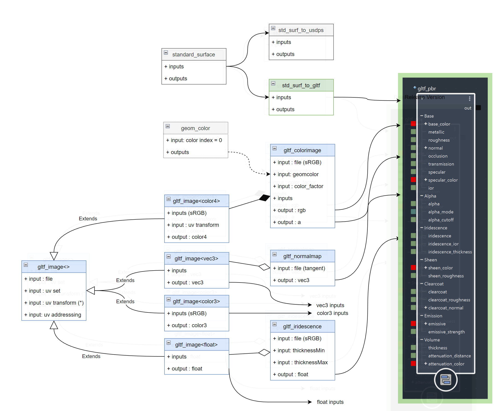
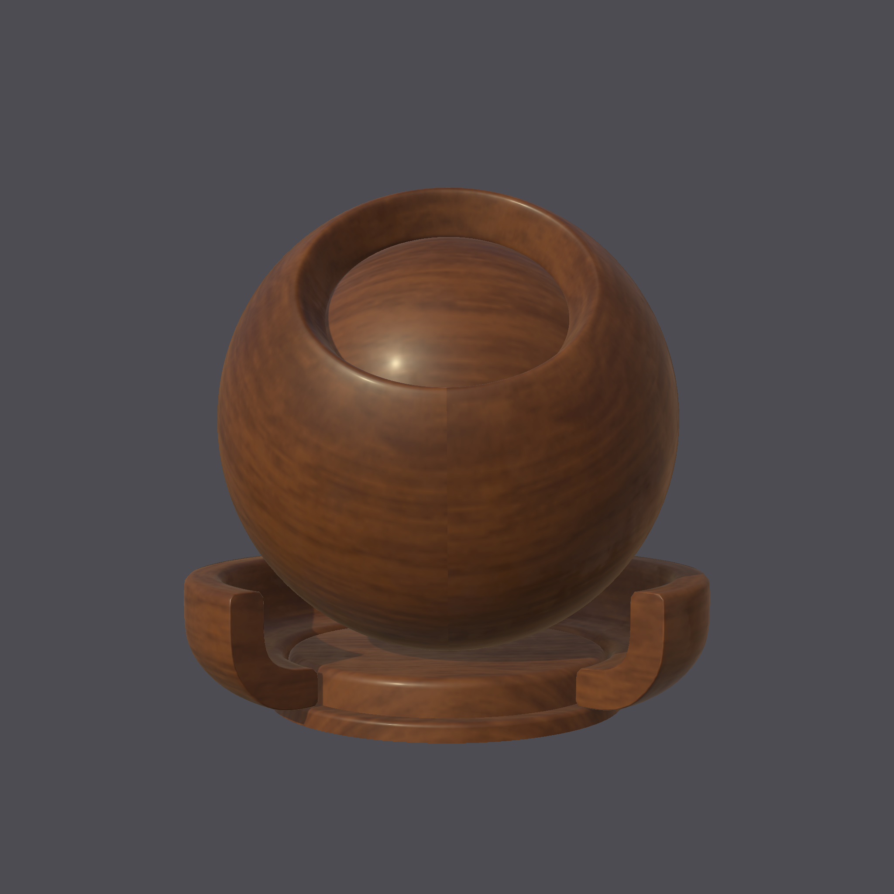
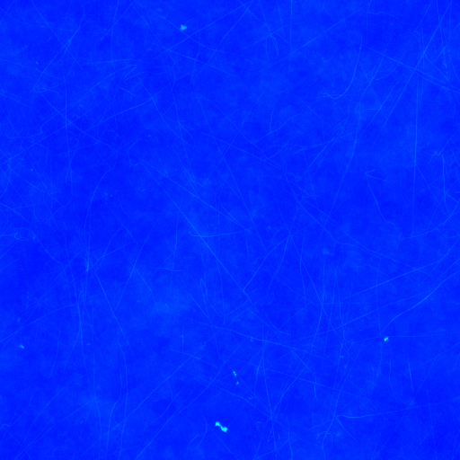
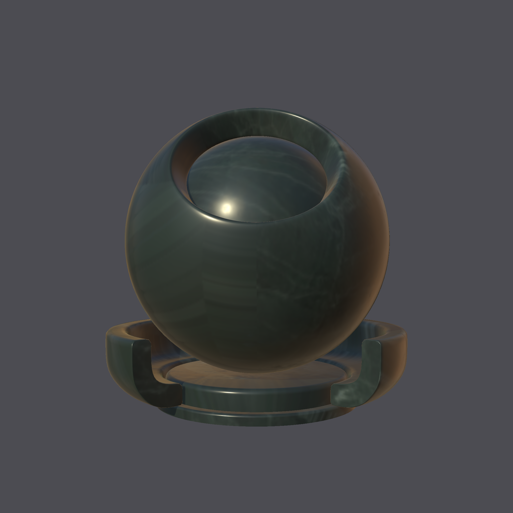
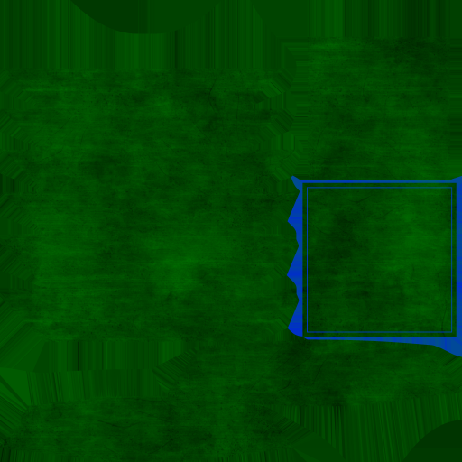

# glTF / MaterialX Support

[](https://github.com/kwokcb/glTF_MaterialX/actions)

## 1. Introduction

This repo contains utilities to support glTF bidirectional MaterialX data model conversion for workflows first described in the [ASWF 2022 Open Source days
presentation](https://materialx.org/assets/ASWF_OSD2022_MaterialX_OSL_Final.pdf).

The supported targets are:
 * glTF version [2.0.1](https://registry.khronos.org/glTF/specs/2.0/glTF-2.0.html) 
* Corresponding MaterialX version which supports this. The minimal target release is [1.38.6.](https://github.com/AcademySoftwareFoundation/MaterialX/releases/tag/v1.38.6). 

Any future specification changes will go into MaterialX core as noted by issues logged [here](https://github.com/AcademySoftwareFoundation/MaterialX/issues)

A [Khronos branch](https://github.com/KhronosGroup/MaterialX/tree/gltf_mtlx_interop) using this library is available in a branch. This
currently includes integration in the MaterialXViewer and
MaterialX GraphEditor. Note that no pipeline tools are integrated there (such as baking) hence export expects the target nodegraph denoted in the next section.

</img>
<br>
</img>
<br>
<sub>Figure: Snapshot of some sample assets imported into the MaterialX GraphEditor</sub>

Some of the documentation for this site will be migrating to the [MaterialX Learning Site](https://kwokcb.github.io/MaterialX_Learn/) (As of August, 2023).
**Stay Tuned**

## 2. Target MaterialX Representation

There is a specific target MaterialX node graph configuration which is the target for distillation / export as well as remixing / import. These nodegraphs can be created in various editors including Maya, Houdini, etc and USD HDStorm integrations in general as long as the appropriate MaterialX library version is used.

</img>
<br><sub>Figure: Layout of "target" nodegraphs. Note that 0 or more upstream pattern graphs are supported for inputs to the root PBR shader</sub>

The definitions for these nodes can be found as part of the [core MaterialX  library definitions](https://github.com/kwokcb/MaterialX/blob/main/libraries/bxdf/gltf_pbr.mtlx)

Documentation for these nodes including nodegraph implementations has been extracted and can be found [here](documents/NodeDescriptions.md)

</img>

The breakdown is into two logical parts:
 * A root shading model instance
 * A small subset of upstream pattern nodes directly connected to the root 

### `2.1 <gltf_pbr>`

The current version of this PBR MaterialX node is `2.0.1` defined using MaterialX core pbr nodes:
```mermaid
graph LR; 
    IMPL_gltf_pbr_surfaceshader_shader_constructor[surface] --> IMPL_gltf_pbr_surfaceshader_out([out])
    style IMPL_gltf_pbr_surfaceshader_out fill:#1b1, color:#111
    IMPL_gltf_pbr_surfaceshader_clearcoat_layer[layer] --".bsdf"--> IMPL_gltf_pbr_surfaceshader_shader_constructor[surface]
    IMPL_gltf_pbr_surfaceshader_clearcoat_bsdf[dielectric_bsdf] --".top"--> IMPL_gltf_pbr_surfaceshader_clearcoat_layer[layer]
    IMPL_gltf_pbr_surfaceshader_clearcoat([clearcoat]) ==.weight==> IMPL_gltf_pbr_surfaceshader_clearcoat_bsdf[dielectric_bsdf]
    style IMPL_gltf_pbr_surfaceshader_clearcoat fill:#0bb, color:#111
    IMPL_gltf_pbr_surfaceshader_clearcoat_normal([clearcoat_normal]) ==.normal==> IMPL_gltf_pbr_surfaceshader_clearcoat_bsdf[dielectric_bsdf]
    style IMPL_gltf_pbr_surfaceshader_clearcoat_normal fill:#0bb, color:#111
    IMPL_gltf_pbr_surfaceshader_clearcoat_roughness_uv[roughness_anisotropy] --".roughness"--> IMPL_gltf_pbr_surfaceshader_clearcoat_bsdf[dielectric_bsdf]
    IMPL_gltf_pbr_surfaceshader_clearcoat_roughness([clearcoat_roughness]) ==.roughness==> IMPL_gltf_pbr_surfaceshader_clearcoat_roughness_uv[roughness_anisotropy]
    style IMPL_gltf_pbr_surfaceshader_clearcoat_roughness fill:#0bb, color:#111
    IMPL_gltf_pbr_surfaceshader_sheen_layer[layer] --".base"--> IMPL_gltf_pbr_surfaceshader_clearcoat_layer[layer]
    IMPL_gltf_pbr_surfaceshader_sheen_bsdf[sheen_bsdf] --".top"--> IMPL_gltf_pbr_surfaceshader_sheen_layer[layer]
    IMPL_gltf_pbr_surfaceshader_normal([normal]) ==.normal==> IMPL_gltf_pbr_surfaceshader_sheen_bsdf[sheen_bsdf]
    style IMPL_gltf_pbr_surfaceshader_normal fill:#0bb, color:#111
    IMPL_gltf_pbr_surfaceshader_sheen_intensity[max] --".weight"--> IMPL_gltf_pbr_surfaceshader_sheen_bsdf[sheen_bsdf]
    IMPL_gltf_pbr_surfaceshader_sheen_color_max_rg[max] --".in1"--> IMPL_gltf_pbr_surfaceshader_sheen_intensity[max]
    IMPL_gltf_pbr_surfaceshader_sheen_color_r[extract] --".in1"--> IMPL_gltf_pbr_surfaceshader_sheen_color_max_rg[max]
    IMPL_gltf_pbr_surfaceshader_sheen_color([sheen_color]) ==.in==> IMPL_gltf_pbr_surfaceshader_sheen_color_r[extract]
    style IMPL_gltf_pbr_surfaceshader_sheen_color fill:#0bb, color:#111
    IMPL_gltf_pbr_surfaceshader_sheen_color_g[extract] --".in2"--> IMPL_gltf_pbr_surfaceshader_sheen_color_max_rg[max]
    IMPL_gltf_pbr_surfaceshader_sheen_color([sheen_color]) ==.in==> IMPL_gltf_pbr_surfaceshader_sheen_color_g[extract]
    style IMPL_gltf_pbr_surfaceshader_sheen_color fill:#0bb, color:#111
    IMPL_gltf_pbr_surfaceshader_sheen_color_b[extract] --".in2"--> IMPL_gltf_pbr_surfaceshader_sheen_intensity[max]
    IMPL_gltf_pbr_surfaceshader_sheen_color([sheen_color]) ==.in==> IMPL_gltf_pbr_surfaceshader_sheen_color_b[extract]
    style IMPL_gltf_pbr_surfaceshader_sheen_color fill:#0bb, color:#111
    IMPL_gltf_pbr_surfaceshader_sheen_color_normalized[divide] --".color"--> IMPL_gltf_pbr_surfaceshader_sheen_bsdf[sheen_bsdf]
    IMPL_gltf_pbr_surfaceshader_sheen_color([sheen_color]) ==.in1==> IMPL_gltf_pbr_surfaceshader_sheen_color_normalized[divide]
    style IMPL_gltf_pbr_surfaceshader_sheen_color fill:#0bb, color:#111
    IMPL_gltf_pbr_surfaceshader_sheen_intensity[max] --".in2"--> IMPL_gltf_pbr_surfaceshader_sheen_color_normalized[divide]
    IMPL_gltf_pbr_surfaceshader_sheen_roughness_sq[multiply] --".roughness"--> IMPL_gltf_pbr_surfaceshader_sheen_bsdf[sheen_bsdf]
    IMPL_gltf_pbr_surfaceshader_sheen_roughness([sheen_roughness]) ==.in1==> IMPL_gltf_pbr_surfaceshader_sheen_roughness_sq[multiply]
    style IMPL_gltf_pbr_surfaceshader_sheen_roughness fill:#0bb, color:#111
    IMPL_gltf_pbr_surfaceshader_sheen_roughness([sheen_roughness]) ==.in2==> IMPL_gltf_pbr_surfaceshader_sheen_roughness_sq[multiply]
    style IMPL_gltf_pbr_surfaceshader_sheen_roughness fill:#0bb, color:#111
    IMPL_gltf_pbr_surfaceshader_base_mix[mix] --".base"--> IMPL_gltf_pbr_surfaceshader_sheen_layer[layer]
    IMPL_gltf_pbr_surfaceshader_metallic([metallic]) ==.mix==> IMPL_gltf_pbr_surfaceshader_base_mix[mix]
    style IMPL_gltf_pbr_surfaceshader_metallic fill:#0bb, color:#111
    IMPL_gltf_pbr_surfaceshader_mix_iridescent_dielectric_bsdf[mix] --".bg"--> IMPL_gltf_pbr_surfaceshader_base_mix[mix]
    IMPL_gltf_pbr_surfaceshader_iridescence([iridescence]) ==.mix==> IMPL_gltf_pbr_surfaceshader_mix_iridescent_dielectric_bsdf[mix]
    style IMPL_gltf_pbr_surfaceshader_iridescence fill:#0bb, color:#111
    IMPL_gltf_pbr_surfaceshader_dielectric_bsdf[layer] --".bg"--> IMPL_gltf_pbr_surfaceshader_mix_iridescent_dielectric_bsdf[mix]
    IMPL_gltf_pbr_surfaceshader_reflection_bsdf[generalized_schlick_bsdf] --".top"--> IMPL_gltf_pbr_surfaceshader_dielectric_bsdf[layer]
    IMPL_gltf_pbr_surfaceshader_normal([normal]) ==.normal==> IMPL_gltf_pbr_surfaceshader_reflection_bsdf[generalized_schlick_bsdf]
    style IMPL_gltf_pbr_surfaceshader_normal fill:#0bb, color:#111
    IMPL_gltf_pbr_surfaceshader_dielectric_f0[multiply] --".color0"--> IMPL_gltf_pbr_surfaceshader_reflection_bsdf[generalized_schlick_bsdf]
    IMPL_gltf_pbr_surfaceshader_specular([specular]) ==.in2==> IMPL_gltf_pbr_surfaceshader_dielectric_f0[multiply]
    style IMPL_gltf_pbr_surfaceshader_specular fill:#0bb, color:#111
    IMPL_gltf_pbr_surfaceshader_clamped_dielectric_f0_from_ior_specular_color[min] --".in1"--> IMPL_gltf_pbr_surfaceshader_dielectric_f0[multiply]
    IMPL_gltf_pbr_surfaceshader_dielectric_f0_from_ior_specular_color[multiply] --".in1"--> IMPL_gltf_pbr_surfaceshader_clamped_dielectric_f0_from_ior_specular_color[min]
    IMPL_gltf_pbr_surfaceshader_specular_color([specular_color]) ==.in1==> IMPL_gltf_pbr_surfaceshader_dielectric_f0_from_ior_specular_color[multiply]
    style IMPL_gltf_pbr_surfaceshader_specular_color fill:#0bb, color:#111
    IMPL_gltf_pbr_surfaceshader_dielectric_f0_from_ior[multiply] --".in2"--> IMPL_gltf_pbr_surfaceshader_dielectric_f0_from_ior_specular_color[multiply]
    IMPL_gltf_pbr_surfaceshader_ior_div[divide] --".in1"--> IMPL_gltf_pbr_surfaceshader_dielectric_f0_from_ior[multiply]
    IMPL_gltf_pbr_surfaceshader_one_minus_ior[subtract] --".in1"--> IMPL_gltf_pbr_surfaceshader_ior_div[divide]
    IMPL_gltf_pbr_surfaceshader_ior([ior]) ==.in2==> IMPL_gltf_pbr_surfaceshader_one_minus_ior[subtract]
    style IMPL_gltf_pbr_surfaceshader_ior fill:#0bb, color:#111
    IMPL_gltf_pbr_surfaceshader_one_plus_ior[add] --".in2"--> IMPL_gltf_pbr_surfaceshader_ior_div[divide]
    IMPL_gltf_pbr_surfaceshader_ior([ior]) ==.in2==> IMPL_gltf_pbr_surfaceshader_one_plus_ior[add]
    style IMPL_gltf_pbr_surfaceshader_ior fill:#0bb, color:#111
    IMPL_gltf_pbr_surfaceshader_ior_div[divide] --".in2"--> IMPL_gltf_pbr_surfaceshader_dielectric_f0_from_ior[multiply]
    IMPL_gltf_pbr_surfaceshader_dielectric_f90[multiply] --".color90"--> IMPL_gltf_pbr_surfaceshader_reflection_bsdf[generalized_schlick_bsdf]
    IMPL_gltf_pbr_surfaceshader_specular([specular]) ==.in2==> IMPL_gltf_pbr_surfaceshader_dielectric_f90[multiply]
    style IMPL_gltf_pbr_surfaceshader_specular fill:#0bb, color:#111
    IMPL_gltf_pbr_surfaceshader_roughness_uv[roughness_anisotropy] --".roughness"--> IMPL_gltf_pbr_surfaceshader_reflection_bsdf[generalized_schlick_bsdf]
    IMPL_gltf_pbr_surfaceshader_roughness([roughness]) ==.roughness==> IMPL_gltf_pbr_surfaceshader_roughness_uv[roughness_anisotropy]
    style IMPL_gltf_pbr_surfaceshader_roughness fill:#0bb, color:#111
    IMPL_gltf_pbr_surfaceshader_transmission_mix[mix] --".base"--> IMPL_gltf_pbr_surfaceshader_dielectric_bsdf[layer]
    IMPL_gltf_pbr_surfaceshader_transmission([transmission]) ==.mix==> IMPL_gltf_pbr_surfaceshader_transmission_mix[mix]
    style IMPL_gltf_pbr_surfaceshader_transmission fill:#0bb, color:#111
    IMPL_gltf_pbr_surfaceshader_diffuse_bsdf[oren_nayar_diffuse_bsdf] --".bg"--> IMPL_gltf_pbr_surfaceshader_transmission_mix[mix]
    IMPL_gltf_pbr_surfaceshader_base_color([base_color]) ==.color==> IMPL_gltf_pbr_surfaceshader_diffuse_bsdf[oren_nayar_diffuse_bsdf]
    style IMPL_gltf_pbr_surfaceshader_base_color fill:#0bb, color:#111
    IMPL_gltf_pbr_surfaceshader_normal([normal]) ==.normal==> IMPL_gltf_pbr_surfaceshader_diffuse_bsdf[oren_nayar_diffuse_bsdf]
    style IMPL_gltf_pbr_surfaceshader_normal fill:#0bb, color:#111
    IMPL_gltf_pbr_surfaceshader_transmission_bsdf[dielectric_bsdf] --".fg"--> IMPL_gltf_pbr_surfaceshader_transmission_mix[mix]
    IMPL_gltf_pbr_surfaceshader_base_color([base_color]) ==.tint==> IMPL_gltf_pbr_surfaceshader_transmission_bsdf[dielectric_bsdf]
    style IMPL_gltf_pbr_surfaceshader_base_color fill:#0bb, color:#111
    IMPL_gltf_pbr_surfaceshader_ior([ior]) ==.ior==> IMPL_gltf_pbr_surfaceshader_transmission_bsdf[dielectric_bsdf]
    style IMPL_gltf_pbr_surfaceshader_ior fill:#0bb, color:#111
    IMPL_gltf_pbr_surfaceshader_normal([normal]) ==.normal==> IMPL_gltf_pbr_surfaceshader_transmission_bsdf[dielectric_bsdf]
    style IMPL_gltf_pbr_surfaceshader_normal fill:#0bb, color:#111
    IMPL_gltf_pbr_surfaceshader_roughness_uv[roughness_anisotropy] --".roughness"--> IMPL_gltf_pbr_surfaceshader_transmission_bsdf[dielectric_bsdf]
    IMPL_gltf_pbr_surfaceshader_iridescent_dielectric_bsdf[layer] --".fg"--> IMPL_gltf_pbr_surfaceshader_mix_iridescent_dielectric_bsdf[mix]
    IMPL_gltf_pbr_surfaceshader_dielectric_thinfilm_bsdf[thin_film_bsdf] --".top"--> IMPL_gltf_pbr_surfaceshader_iridescent_dielectric_bsdf[layer]
    IMPL_gltf_pbr_surfaceshader_iridescence_thickness([iridescence_thickness]) ==.thickness==> IMPL_gltf_pbr_surfaceshader_dielectric_thinfilm_bsdf[thin_film_bsdf]
    style IMPL_gltf_pbr_surfaceshader_iridescence_thickness fill:#0bb, color:#111
    IMPL_gltf_pbr_surfaceshader_iridescence_ior([iridescence_ior]) ==.ior==> IMPL_gltf_pbr_surfaceshader_dielectric_thinfilm_bsdf[thin_film_bsdf]
    style IMPL_gltf_pbr_surfaceshader_iridescence_ior fill:#0bb, color:#111
    IMPL_gltf_pbr_surfaceshader_tf_dielectric_bsdf[layer] --".base"--> IMPL_gltf_pbr_surfaceshader_iridescent_dielectric_bsdf[layer]
    IMPL_gltf_pbr_surfaceshader_tf_reflection_bsdf[generalized_schlick_bsdf] --".top"--> IMPL_gltf_pbr_surfaceshader_tf_dielectric_bsdf[layer]
    IMPL_gltf_pbr_surfaceshader_normal([normal]) ==.normal==> IMPL_gltf_pbr_surfaceshader_tf_reflection_bsdf[generalized_schlick_bsdf]
    style IMPL_gltf_pbr_surfaceshader_normal fill:#0bb, color:#111
    IMPL_gltf_pbr_surfaceshader_dielectric_f0[multiply] --".color0"--> IMPL_gltf_pbr_surfaceshader_tf_reflection_bsdf[generalized_schlick_bsdf]
    IMPL_gltf_pbr_surfaceshader_dielectric_f90[multiply] --".color90"--> IMPL_gltf_pbr_surfaceshader_tf_reflection_bsdf[generalized_schlick_bsdf]
    IMPL_gltf_pbr_surfaceshader_roughness_uv[roughness_anisotropy] --".roughness"--> IMPL_gltf_pbr_surfaceshader_tf_reflection_bsdf[generalized_schlick_bsdf]
    IMPL_gltf_pbr_surfaceshader_tf_transmission_mix[mix] --".base"--> IMPL_gltf_pbr_surfaceshader_tf_dielectric_bsdf[layer]
    IMPL_gltf_pbr_surfaceshader_transmission([transmission]) ==.mix==> IMPL_gltf_pbr_surfaceshader_tf_transmission_mix[mix]
    style IMPL_gltf_pbr_surfaceshader_transmission fill:#0bb, color:#111
    IMPL_gltf_pbr_surfaceshader_tf_diffuse_bsdf[oren_nayar_diffuse_bsdf] --".bg"--> IMPL_gltf_pbr_surfaceshader_tf_transmission_mix[mix]
    IMPL_gltf_pbr_surfaceshader_base_color([base_color]) ==.color==> IMPL_gltf_pbr_surfaceshader_tf_diffuse_bsdf[oren_nayar_diffuse_bsdf]
    style IMPL_gltf_pbr_surfaceshader_base_color fill:#0bb, color:#111
    IMPL_gltf_pbr_surfaceshader_normal([normal]) ==.normal==> IMPL_gltf_pbr_surfaceshader_tf_diffuse_bsdf[oren_nayar_diffuse_bsdf]
    style IMPL_gltf_pbr_surfaceshader_normal fill:#0bb, color:#111
    IMPL_gltf_pbr_surfaceshader_tf_transmission_bsdf[dielectric_bsdf] --".fg"--> IMPL_gltf_pbr_surfaceshader_tf_transmission_mix[mix]
    IMPL_gltf_pbr_surfaceshader_base_color([base_color]) ==.tint==> IMPL_gltf_pbr_surfaceshader_tf_transmission_bsdf[dielectric_bsdf]
    style IMPL_gltf_pbr_surfaceshader_base_color fill:#0bb, color:#111
    IMPL_gltf_pbr_surfaceshader_ior([ior]) ==.ior==> IMPL_gltf_pbr_surfaceshader_tf_transmission_bsdf[dielectric_bsdf]
    style IMPL_gltf_pbr_surfaceshader_ior fill:#0bb, color:#111
    IMPL_gltf_pbr_surfaceshader_normal([normal]) ==.normal==> IMPL_gltf_pbr_surfaceshader_tf_transmission_bsdf[dielectric_bsdf]
    style IMPL_gltf_pbr_surfaceshader_normal fill:#0bb, color:#111
    IMPL_gltf_pbr_surfaceshader_roughness_uv[roughness_anisotropy] --".roughness"--> IMPL_gltf_pbr_surfaceshader_tf_transmission_bsdf[dielectric_bsdf]
    IMPL_gltf_pbr_surfaceshader_mix_iridescent_metal_bsdf[mix] --".fg"--> IMPL_gltf_pbr_surfaceshader_base_mix[mix]
    IMPL_gltf_pbr_surfaceshader_iridescence([iridescence]) ==.mix==> IMPL_gltf_pbr_surfaceshader_mix_iridescent_metal_bsdf[mix]
    style IMPL_gltf_pbr_surfaceshader_iridescence fill:#0bb, color:#111
    IMPL_gltf_pbr_surfaceshader_metal_bsdf[generalized_schlick_bsdf] --".bg"--> IMPL_gltf_pbr_surfaceshader_mix_iridescent_metal_bsdf[mix]
    IMPL_gltf_pbr_surfaceshader_base_color([base_color]) ==.color0==> IMPL_gltf_pbr_surfaceshader_metal_bsdf[generalized_schlick_bsdf]
    style IMPL_gltf_pbr_surfaceshader_base_color fill:#0bb, color:#111
    IMPL_gltf_pbr_surfaceshader_normal([normal]) ==.normal==> IMPL_gltf_pbr_surfaceshader_metal_bsdf[generalized_schlick_bsdf]
    style IMPL_gltf_pbr_surfaceshader_normal fill:#0bb, color:#111
    IMPL_gltf_pbr_surfaceshader_roughness_uv[roughness_anisotropy] --".roughness"--> IMPL_gltf_pbr_surfaceshader_metal_bsdf[generalized_schlick_bsdf]
    IMPL_gltf_pbr_surfaceshader_iridescent_metal_bsdf[layer] --".fg"--> IMPL_gltf_pbr_surfaceshader_mix_iridescent_metal_bsdf[mix]
    IMPL_gltf_pbr_surfaceshader_metal_thinfilm_bsdf[thin_film_bsdf] --".top"--> IMPL_gltf_pbr_surfaceshader_iridescent_metal_bsdf[layer]
    IMPL_gltf_pbr_surfaceshader_iridescence_thickness([iridescence_thickness]) ==.thickness==> IMPL_gltf_pbr_surfaceshader_metal_thinfilm_bsdf[thin_film_bsdf]
    style IMPL_gltf_pbr_surfaceshader_iridescence_thickness fill:#0bb, color:#111
    IMPL_gltf_pbr_surfaceshader_iridescence_ior([iridescence_ior]) ==.ior==> IMPL_gltf_pbr_surfaceshader_metal_thinfilm_bsdf[thin_film_bsdf]
    style IMPL_gltf_pbr_surfaceshader_iridescence_ior fill:#0bb, color:#111
    IMPL_gltf_pbr_surfaceshader_tf_metal_bsdf[generalized_schlick_bsdf] --".base"--> IMPL_gltf_pbr_surfaceshader_iridescent_metal_bsdf[layer]
    IMPL_gltf_pbr_surfaceshader_base_color([base_color]) ==.color0==> IMPL_gltf_pbr_surfaceshader_tf_metal_bsdf[generalized_schlick_bsdf]
    style IMPL_gltf_pbr_surfaceshader_base_color fill:#0bb, color:#111
    IMPL_gltf_pbr_surfaceshader_normal([normal]) ==.normal==> IMPL_gltf_pbr_surfaceshader_tf_metal_bsdf[generalized_schlick_bsdf]
    style IMPL_gltf_pbr_surfaceshader_normal fill:#0bb, color:#111
    IMPL_gltf_pbr_surfaceshader_roughness_uv[roughness_anisotropy] --".roughness"--> IMPL_gltf_pbr_surfaceshader_tf_metal_bsdf[generalized_schlick_bsdf]
    IMPL_gltf_pbr_surfaceshader_emission[uniform_edf] --".edf"--> IMPL_gltf_pbr_surfaceshader_shader_constructor[surface]
    IMPL_gltf_pbr_surfaceshader_emission_color[multiply] --".color"--> IMPL_gltf_pbr_surfaceshader_emission[uniform_edf]
    IMPL_gltf_pbr_surfaceshader_emissive([emissive]) ==.in1==> IMPL_gltf_pbr_surfaceshader_emission_color[multiply]
    style IMPL_gltf_pbr_surfaceshader_emissive fill:#0bb, color:#111
    IMPL_gltf_pbr_surfaceshader_emissive_strength([emissive_strength]) ==.in2==> IMPL_gltf_pbr_surfaceshader_emission_color[multiply]
    style IMPL_gltf_pbr_surfaceshader_emissive_strength fill:#0bb, color:#111
    IMPL_gltf_pbr_surfaceshader_opacity[ifequal] --".opacity"--> IMPL_gltf_pbr_surfaceshader_shader_constructor[surface]
    IMPL_gltf_pbr_surfaceshader_alpha_mode([alpha_mode]) ==.value1==> IMPL_gltf_pbr_surfaceshader_opacity[ifequal]
    style IMPL_gltf_pbr_surfaceshader_alpha_mode fill:#0bb, color:#111
    IMPL_gltf_pbr_surfaceshader_opacity_mask[ifequal] --".in2"--> IMPL_gltf_pbr_surfaceshader_opacity[ifequal]
    IMPL_gltf_pbr_surfaceshader_alpha_mode([alpha_mode]) ==.value1==> IMPL_gltf_pbr_surfaceshader_opacity_mask[ifequal]
    style IMPL_gltf_pbr_surfaceshader_alpha_mode fill:#0bb, color:#111
    IMPL_gltf_pbr_surfaceshader_alpha([alpha]) ==.in2==> IMPL_gltf_pbr_surfaceshader_opacity_mask[ifequal]
    style IMPL_gltf_pbr_surfaceshader_alpha fill:#0bb, color:#111
    IMPL_gltf_pbr_surfaceshader_opacity_mask_cutoff[ifgreatereq] --".in1"--> IMPL_gltf_pbr_surfaceshader_opacity_mask[ifequal]
    IMPL_gltf_pbr_surfaceshader_alpha([alpha]) ==.value1==> IMPL_gltf_pbr_surfaceshader_opacity_mask_cutoff[ifgreatereq]
    style IMPL_gltf_pbr_surfaceshader_alpha fill:#0bb, color:#111
    IMPL_gltf_pbr_surfaceshader_alpha_cutoff([alpha_cutoff]) ==.value2==> IMPL_gltf_pbr_surfaceshader_opacity_mask_cutoff[ifgreatereq]
    style IMPL_gltf_pbr_surfaceshader_alpha_cutoff fill:#0bb, color:#111

```
See [here](https://kwokcb.github.io/MaterialX_Learn/documents/definitions/gltf_pbr.html) for a description of the node.

<!-- </img> -->

As Khronos extensions are added the subversion will be incremented. 
  
### `2.2 <gltf_image>`
This node provides an interface which matches how image lookup are performed within glTF 2.0 based on this [spec](https://github.com/KhronosGroup/glTF/blob/main/extensions/2.0/Khronos/KHR_texture_transform/README.md)

<details open><summary>Details</summary>
<p>

This includes handling these differences:
* The transform pivot is 0,0 for MaterialX but 0,1 for glTF.
  * Offset is thus negated in V
* Rotation is specified as radians versus angles and is reverse direction. (negation required)
* Scale is inverted between MaterialX and glTF
* The default transformation order is TRS for glTF and not SRT.

This is supported for all variants of this node: vector3, float, color3, and color4. No vector2 variant is required at this time.
* One texture coordinate set referenced by set name, with the default set being "UV0" which is equal to set 0.
  * Names are used to support **OpenUSD** workflows where al sets are named.
  * A `<texcoord>` node which a different index can be connected to provide index based workflows as found for glTF.
* U and V address modes and filter type are accessible with the defaults for glTF and MaterialX matching.

The color4 output is split into color3 and alpha outputs which can be directly mapped to a `gltf_pbr` node.

If in the future real world units are supported in glTF then the appropriate semantic unit tagging can be added to 
the existing inputs are additional inputs. Input values are not considered to be mappable and hence if a unit semantic is provided import / export can handle this via either a 3rd-party or built in scale unit conversion utility.

</details>

### `2.3 <gltf_colorimage>`
Node for handling input of color images. Inherits properties from `<gltf_image>`
<details><summary>Details</summary>
<p>

This encapsulates color/alpha management where an color4 image lookup can be modulated by a color4 factor as well as geometric color4. That is final color is (base on this [post](https://github.com/KhronosGroup/glTF/issues/1638)):
```
  color4_image * color4_factor * geometry_color4
```
The input image can have a "colorspace" semantic specified. By default for import/export this should be `srgb_texture` but is not hard-coded as part of the definition. Color factor is set to be uniform and both it and geometry color are assumed to be specified in the rendering / target colorspace.

As not all geometry have geometric colors , the default "geometry color" input is a uniform value = { 1,1,1,1 }
which can be mapped to a `<geomcolor>` node as required. That node allows for color set index to be set with the
default being set 0.Compliant texture transform support is provided by using a `gltf_image` node as part of it's definition.

</details>

### `2.4 <gtlf_normalmap>`

Node for handling input of tangent space normal map images. Inherits properties from `<gltf_image>`
<details><summary>Details</summary>
<p>

This node encapsulates a file texture which is a normal map. It uses `<gltf_vector3>` and `<normalmap>` as it's main components to provide base level glTF support which always outputs a normal map.  normalmap space is not an exposed interface and is always set to tangent space, with a default / fallback value of { 0.5, 0.5, 1.0 } if no input image is specified.

Compliant texture transform support is provided by using a <gltf_image> node as part of it's definition.

</details>

### `2.5 <gltf_iridescence_thickness>`

Node for handling "thickness" images. Inherits properties from `<gltf_image>`
<details><summary>Details</summary>
<p>

This node handles user input for a "thickness" image which is mapped to a thickness "min" and "max" to scale the images output (g channel) as defined [here](https://github.com/KhronosGroup/glTF/blob/main/extensions/2.0/Khronos/KHR_materials_iridescence/README.md). This produces a float thickness output which can be connected to gttf_pbr "iridescence ior". 

Compliant glTF texture transform support is provided by using a <gltf_image> in it's implementation.

</details>
<p>

### 2.6 Units and Color Management Notes

Note that real world distance units are not explicitly used but can be added in on top of the supplemental nodes.

Color management is assumed not to be applied to any of these nodes but there is no way to restrict this. The defaults for colored texture match glTF (`srgb_texture` = sRGB), and "render space" for uniforms and varying geometric color by default.

### 2.7 Material Assignments

The current target for MaterialX material assignments is basic `<materialassign>` nodes as part of one or more `<look>`s. For simplicity and the ability to be
parsable by MaterialX integrations such as USD an assignment which uses explicit `geom` specifiers is recommended. Thus assignments which use regular expressions is not supported.

Conversely for glTF assignments direct assignment are supported at any transform or leaf depth. Variants are not supported at this time.

## 3. Implementation Breakdown

### 3.1 MaterialXglTF

This is the main module containing core logic for bi-directional mapping.
This module can be used directly.

### 3.2 glTFMtlx

This is a sample C++ program which uses the MaterialxglTF module to allow command line conversion. Run `glTF2Mtlx --help` for command line options.

### 3.3 glTFMtlxTest

This contains unit testing for the MaterialXglTF module. It performs bidirectional conversion from and to glTF for the set of input files specified in the `resources` direction. Currently this contains a basic set of [glTF Sample model](https://github.com/KhronosGroup/glTF-Sample-Models) files.

### 3.4 Developer Docs
See [Developer Docs](documents/Developer.md) for more details.

## 4. Support

</img>

The basic import from glTF to MaterialX and MaterialX to glTF for  shading models: gltf_pbr or `unlit_surface` (if the material is marked as being unit`. Texture mapping is supported for import however texture transforms are not supported yet for export. 

Color per vertex associated alpha blending are supported. Import detection
uses a heuristic of checking if the assigned geometry has a color channel to add a default color channel binding to the input on the graph node.

| Flght Helmet | Alpha Blend Test | Vertex Color Test | 
| --- | --- | --- | 
| </img>  | </img> | </img> |

## 5. Results

The [current "Boombox" asset](https://github.com/AcademySoftwareFoundation/MaterialX/blob/main/resources/Materials/Examples/GltfPbr/gltf_pbr_boombox.mtlx) which is distributed as part of MaterialX is generated using the glTF to MaterialX utility.

### 5.1 glTF Import 

<details open><summary>Sample Results</summary>

Note that all renders are generated as part of unit tests using the core `MaterialXView` program.

| Asset | MaterialX from glTF | glTF from MaterialX | Render |
| -- | -- | -- | -- |   
| glTF Logo | <a href="./docs/glTF_fromgltf.mtlx">MaterialX</a> | <a href="./docs/glTF_fromtlx.gltf">GLTF</a> | </img> |
| Chess Set | <a href="./docs/ABeautifulGame_fromgltf.mtlx">MaterialX</a> | <a href="./docs/ABeautifulGame_fromtlx.gltf">GLTF</a> | </img> |
| Damaged Helmet | <a href="./docs/DamagedHelmet_fromgltf.mtlx">MaterialX</a> | <a href="./docs/DamagedHelmet_fromtlx.gltf">GLTF</a> | </img> |
| Boombox with Axes | <a href="./docs/BoomBoxWithAxes_fromgltf.mtlx">MaterialX</a> | <a href="./docs/BoomBoxWithAxes_fromtlx.gltf">GLTF</a> | </img> |
| Iridescence Lamp | <a href="./docs/IridescenceLamp_fromgltf.mtlx">MaterialX</a> | <a href="./docs/IridescenceLamp_fromtlx.gltf">GLTF</a> | </img> |
| Texture Transform Test | <a href="./docs/TextureTransformTest_fromgltf.mtlx">MaterialX</a> | <a href="./docs/TextureTransformTest_fromtlx.gltf">GLTF</a> | </img> |
| Unlit Test | <a href="./docs/UnlitTest_fromgltf.mtlx">MaterialX</a> | <a href="./docs/UnlitTest_fromtlx.gltf">GLTF</a> | </img> |

</details>
<p>

### 5.2 glTF Export

<details open><summary>Sample Results</summary>

Conversion from "stock" MaterialX materials to glTF is available for "distilation". 

Metallic-roughness-occlusion (ORM) maps are generated based on whether there are any graph connections for `occlusion`, `metallic` and `roughness` inputs on a `<gtlf_pbr>` instance. If metallic and or roughness are mapped to different inputs then the upstream image(s) or uniform input(s) are merged. This allows for (re)import to `<gltf_colorimage>` which supports channel splitting of the merged image.

| Asset | MaterialX to glTF | glTF to MaterialX | Render | Notes |
| --- | --- | --- | --- | --- |
| Jade | <a href="./docs/standard_surface_jade_fromtlx.gltf">glTF</a> | <a href="./docs/standard_surface_jade_baked.mtlx">MTLX</a> | </img> | |
| Marble | <a href="./docs/standard_surface_marble_solid_fromtlx.gltf">glTF</a> | <a href="./docs/standard_surface_marble_solid_baked.mtlx">MTLX</a> | </img> | Fidelity and control lost in baking </img> |
| Plastic | <a href="./docs/standard_surface_plastic_fromtlx.gltf">glTF</a> | <a href="./docs/standard_surface_plastic_baked.mtlx">MTLX</a> | </img> | |
| Wood | <a href="./docs/standard_surface_wood_tiled_fromtlx.gltf">glTF</a> | <a href="./docs/standard_surface_wood_tiled_baked.mtlx">MTLX</a> | </img> | ORM map created </img> |
| Brass | <a href="./docs/standard_surface_brass_tiled_fromtlx.gltf">glTF</a> | <a href="./docs/standard_surface_brass_tiled_baked.mtlx">MTLX</a> | </img> | ORM map created </img> |
| Chess Piece | <a href="./docs/standard_surface_chess_set_fromtlx.gltf">glTF</a> | <a href="./docs/standard_surface_chess_set_baked.mtlx">MTLX</a> | </img> | ORM map created </img> |
| Brick | <a href="./docs/standard_surface_brick_procedural_fromtlx.gltf">glTF</a> | <a href="./docs/standard_surface_brick_procedural_baked.mtlx">MTLX</a> | </img> | ORM map created </img> |
| Calibration | <a href="./docs/standard_surface_greysphere_calibration.gltf">glTF</a> | <a href="./docs/standard_surface_greysphere_calibration_baked.mtlx">MTLX</a> | </img> | |
| Velvet | <a href="./docs/standard_surface_velvet.gltf">glTF</a> | <a href="./docs/standard_surface_velvet_baked.mtlx">MTLX</a> | </img> | |

</details>

The setup uses the `shader translation` graph
found [here](https://github.com/AcademySoftwareFoundation/MaterialX/blob/main/libraries/bxdf/translation/standard_surface_to_gltf_pbr.mtlx) to accomplish the workflow as presented in the ASWF presentation:

</img> |

An expanded example is shown here for tiled brass.
</img>

<details>
<summary>Shader translation graph inserted</summary>

```xml
<?xml version="1.0"?>
<materialx version="1.38" colorspace="lin_rec709" fileprefix="../../../Images/">
  <nodegraph name="NG_brass1">
    <tiledimage name="image_color" type="color3">
      <input name="file" type="filename" value="brass_color.jpg" colorspace="srgb_texture" />
      <input name="uvtiling" type="vector2" value="1.0, 1.0" />
    </tiledimage>
    <tiledimage name="image_roughness" type="float">
      <input name="file" type="filename" value="brass_roughness.jpg" />
      <input name="uvtiling" type="vector2" value="1.0, 1.0" />
    </tiledimage>
    <standard_surface_to_gltf_pbr name="node1" type="multioutput" nodedef="ND_standard_surface_to_gltf_pbr">
      <input name="base" type="float" value="1" />
      <input name="base_color" type="color3" value="1, 1, 1" />
      <input name="specular_roughness" type="float" nodename="image_roughness" />
      <input name="metalness" type="float" value="1" />
      <input name="coat" type="float" value="1" />
      <input name="coat_color" type="color3" nodename="image_color" />
      <input name="coat_roughness" type="float" nodename="image_roughness" />
    </standard_surface_to_gltf_pbr>
    <output name="base_color_out" type="color3" nodename="node1" output="base_color_out" />
    <output name="metallic_out" type="float" nodename="node1" output="metallic_out" />
    <output name="roughness_out" type="float" nodename="node1" output="roughness_out" />
    <output name="transmission_out" type="float" nodename="node1" output="transmission_out" />
    <output name="thickness_out" type="float" nodename="node1" output="thickness_out" />
    <output name="attenuation_color_out" type="color3" nodename="node1" output="attenuation_color_out" />
    <output name="sheen_color_out" type="color3" nodename="node1" output="sheen_color_out" />
    <output name="sheen_roughness_out" type="float" nodename="node1" output="sheen_roughness_out" />
    <output name="clearcoat_out" type="float" nodename="node1" output="clearcoat_out" />
    <output name="clearcoat_roughness_out" type="float" nodename="node1" output="clearcoat_roughness_out" />
    <output name="emissive_out" type="color3" nodename="node1" output="emissive_out" />
  </nodegraph>
  <gltf_pbr name="SR_brass1" type="surfaceshader">
    <input name="base_color" type="color3" output="base_color_out" nodegraph="NG_brass1" />
    <input name="metallic" type="float" output="metallic_out" nodegraph="NG_brass1" />
    <input name="roughness" type="float" output="roughness_out" nodegraph="NG_brass1" />
    <input name="transmission" type="float" output="transmission_out" nodegraph="NG_brass1" />
    <input name="thickness" type="float" output="thickness_out" nodegraph="NG_brass1" />
    <input name="attenuation_color" type="color3" output="attenuation_color_out" nodegraph="NG_brass1" />
    <input name="sheen_color" type="color3" output="sheen_color_out" nodegraph="NG_brass1" />
    <input name="sheen_roughness" type="float" output="sheen_roughness_out" nodegraph="NG_brass1" />
    <input name="clearcoat" type="float" output="clearcoat_out" nodegraph="NG_brass1" />
    <input name="clearcoat_roughness" type="float" output="clearcoat_roughness_out" nodegraph="NG_brass1" />
    <input name="emissive" type="color3" output="emissive_out" nodegraph="NG_brass1" />
  </gltf_pbr>
  <surfacematerial name="Tiled_Brass" type="material">
    <input name="surfaceshader" type="surfaceshader" nodename="SR_brass1" />
  </surfacematerial>
</materialx>

```
</details>
<details><summary>Results of baking of graph</summary>

```XML
<?xml version="1.0"?>
<materialx version="1.38" colorspace="lin_rec709">
  <nodegraph name="NG_baked" colorspace="srgb_texture">
    <image name="base_color_baked" type="color3">
      <input name="file" type="filename" value="D:\Work\materialx\glTF_MaterialX\build\bin\resources\glTF_export\Materials\Examples\StandardSurface\Tiled_Brass_gltf_pbr_base_color.png" />
    </image>
    <output name="base_color_output" type="color3" nodename="base_color_baked" />
    <image name="roughness_baked" type="float">
      <input name="file" type="filename" value="D:\Work\materialx\glTF_MaterialX\build\bin\resources\glTF_export\Materials\Examples\StandardSurface\Tiled_Brass_gltf_pbr_roughness.png" />
    </image>
    <output name="roughness_output" type="float" nodename="roughness_baked" />
    <image name="clearcoat_baked" type="float">
      <input name="file" type="filename" value="D:\Work\materialx\glTF_MaterialX\build\bin\resources\glTF_export\Materials\Examples\StandardSurface\Tiled_Brass_gltf_pbr_clearcoat.png" />
    </image>
    <output name="clearcoat_output" type="float" nodename="clearcoat_baked" />
    <image name="clearcoat_roughness_baked" type="float">
      <input name="file" type="filename" value="D:\Work\materialx\glTF_MaterialX\build\bin\resources\glTF_export\Materials\Examples\StandardSurface\Tiled_Brass_gltf_pbr_clearcoat_roughness.png" />
    </image>
    <output name="clearcoat_roughness_output" type="float" nodename="clearcoat_roughness_baked" />
  </nodegraph>
  <gltf_pbr name="SR_brass1_baked" type="surfaceshader">
    <input name="base_color" type="color3" output="base_color_output" nodegraph="NG_baked" />
    <input name="roughness" type="float" output="roughness_output" nodegraph="NG_baked" />
    <input name="clearcoat" type="float" output="clearcoat_output" nodegraph="NG_baked" />
    <input name="clearcoat_roughness" type="float" output="clearcoat_roughness_output" nodegraph="NG_baked" />
  </gltf_pbr>
  <surfacematerial name="Tiled_Brass_baked" type="material">
    <input name="surfaceshader" type="surfaceshader" nodename="SR_brass1_baked" />
  </surfacematerial>
</materialx>
```

</details>
<details><summary>Converted to glTF</summary>

ORM map merging occurs during this step to create the "combined" BGRA image created and referenced.
```JSON
{
  "asset": {
    "copyright": "Created via glTF translation utilities found here: https://github.com/kwokcb/glTF_MaterialX",
    "generator": "MaterialX 1.38.7 to glTF 2.0 generator",
    "version": "2.0"
  },
  "images": [
    {
      "name": "NG_baked/base_color_baked",
      "uri": "D:/Work/materialx/glTF_MaterialX/build/bin/resources/glTF_export/Materials/Examples/StandardSurface/Tiled_Brass_gltf_pbr_base_color.png"
    },
    {
      "name": "NG_baked/roughness_baked",
      "uri": "D:/Work/materialx/glTF_MaterialX/build/bin/resources/glTF_export/Materials/Examples/StandardSurface/Tiled_Brass_gltf_pbr_roughness_combined.png"
    },
    {
      "name": "NG_baked/clearcoat_baked",
      "uri": "D:/Work/materialx/glTF_MaterialX/build/bin/resources/glTF_export/Materials/Examples/StandardSurface/Tiled_Brass_gltf_pbr_clearcoat.png"
    },
    {
      "name": "NG_baked/clearcoat_roughness_baked",
      "uri": "D:/Work/materialx/glTF_MaterialX/build/bin/resources/glTF_export/Materials/Examples/StandardSurface/Tiled_Brass_gltf_pbr_clearcoat_roughness.png"
    }
  ],
  "materials": [
    {
      "name": "SR_brass1_baked",
      "pbrMetallicRoughness": {
        "baseColorTexture": {
          "index": 0
        },
        "metallicRoughnessTexture": {
          "index": 1
        }
      },
      "extensions": {
        "KHR_materials_clearcoat": {
          "clearcoatTexture": {
            "index": 2,
            "scale": 0
          },
          "clearcoatRoughnessTexture": {
            "index": 3,
            "scale": 0
          },
          "clearcoatFactor": 1,
          "clearcoatRoughnessFactor": 1
        },
        "KHR_materials_ior": {
        },
        "KHR_materials_specular": {
        },
        "KHR_materials_transmission": {
        },
        "KHR_materials_sheen": {
        },
        "KHR_materials_emissive_strength": {
        },
        "KHR_materials_iridescence": {
          "iridescenceIor": 1,
          "iridescenceThicknessMinimum": 0,
          "iridescenceThicknessMaximum": 0
        }
      }
    }
  ],
  "textures": [
    {
      "name": "NG_baked/base_color_baked",
      "source": 0
    },
    {
      "name": "NG_baked/roughness_baked",
      "source": 1
    },
    {
      "name": "NG_baked/clearcoat_baked",
      "source": 2
    },
    {
      "name": "NG_baked/clearcoat_roughness_baked",
      "source": 3
    }
  ],
  "extensionsUsed": [
    "KHR_materials_clearcoat",
    "KHR_materials_ior",
    "KHR_materials_specular",
    "KHR_materials_transmission",
    "KHR_materials_sheen",
    "KHR_materials_emissive_strength",
    "KHR_materials_iridescence"
  ]
}
```
</details>
<details><summary>Re-imported back to MaterialX</summary>

```xml
<?xml version="1.0"?>
<materialx version="1.38">
  <gltf_pbr name="SHD_SR_brass1_baked" type="surfaceshader">
    <input name="base_color" type="color3" nodename="NG_baked_base_color_baked" />
    <input name="metallic" type="float" value="1" nodename="NG_baked_roughness_baked" channels="z" />
    <input name="roughness" type="float" value="1" nodename="NG_baked_roughness_baked" channels="y" />
    <input name="occlusion" type="float" value="1" nodename="NG_baked_roughness_baked" channels="x" />
    <input name="sheen_color" type="color3" value="0, 0, 0" />
    <input name="sheen_roughness" type="float" value="0" />
    <input name="iridescence" type="float" value="0" />
    <input name="iridescence_ior" type="float" value="1" />
    <input name="iridescence_thickness" type="float" value="100" />
    <input name="clearcoat" type="float" nodename="image_clearcoat" />
    <input name="clearcoat_roughness" type="float" nodename="image_clearcoat_roughness" />
    <input name="transmission" type="float" value="0" />
    <input name="specular_color" type="color3" value="1, 1, 1" />
    <input name="specular" type="float" value="1" />
    <input name="ior" type="float" value="1.5" />
    <input name="emissive" type="color3" value="0, 0, 0" />
    <input name="emissive_strength" type="float" value="1" />
  </gltf_pbr>
  <surfacematerial name="MAT_SR_brass1_baked" type="material">
    <input name="surfaceshader" type="surfaceshader" nodename="SHD_SR_brass1_baked" />
  </surfacematerial>
  <gltf_image name="NG_baked_base_color_baked" type="color3">
    <input name="file" type="filename" value="D:/Work/materialx/glTF_MaterialX/build/bin/resources/glTF_export/Materials/Examples/StandardSurface/Tiled_Brass_gltf_pbr_base_color.png" colorspace="srgb_texture" />
  </gltf_image>
  <gltf_image name="NG_baked_roughness_baked" type="vector3">
    <input name="file" type="filename" value="D:/Work/materialx/glTF_MaterialX/build/bin/resources/glTF_export/Materials/Examples/StandardSurface/Tiled_Brass_gltf_pbr_roughness_combined.png" />
  </gltf_image>
  <gltf_image name="image_clearcoat" type="float">
    <input name="file" type="filename" value="D:/Work/materialx/glTF_MaterialX/build/bin/resources/glTF_export/Materials/Examples/StandardSurface/Tiled_Brass_gltf_pbr_clearcoat.png" />
  </gltf_image>
  <gltf_image name="image_clearcoat_roughness" type="float">
    <input name="file" type="filename" value="D:/Work/materialx/glTF_MaterialX/build/bin/resources/glTF_export/Materials/Examples/StandardSurface/Tiled_Brass_gltf_pbr_clearcoat_roughness.png" />
  </gltf_image>
  <look name="look1" />
</materialx>
```
</details>
