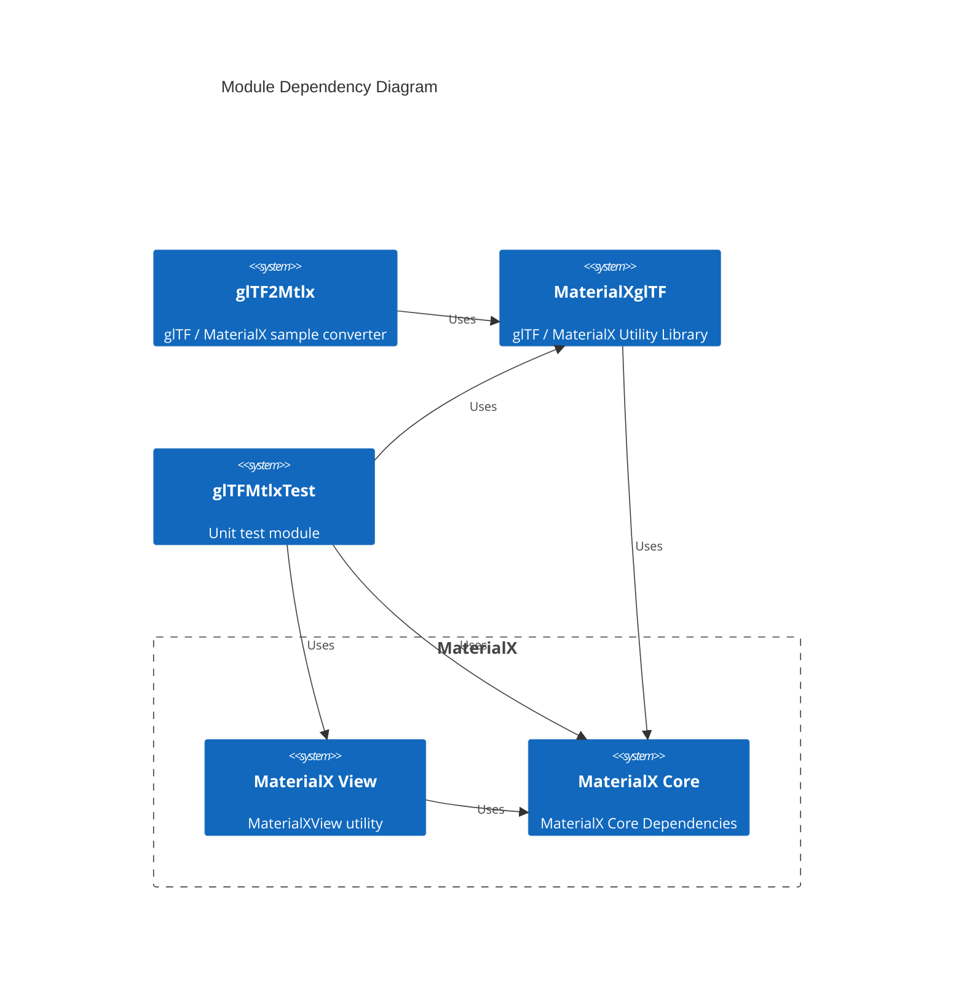

# Developer Documentation



The main dependency for the project is MaterialX. This is pulled in a  submodule and placed in `<root>/MaterialX` where `<root>` is the root of the repo. The
submodule should be recursively updated using

```
git submodule update --init --recursive
```

before building. The recursive pull is required as MaterialView is built and this has sub-dependencies.

This will be built first and used to build the base utility library: `MaterialXglTF`.

## Build Options
The current build options include:

* **GLTF_MATERIALX_TEST_RENDER** : When enabled, render tests will be performed using MaterialXView to render MaterialX files and save out as images.

## Unit tests
The module: `gltfMtlxTest` performs the basic import and export unit tests. 

* For import from glTF a subset of files is packaged and tested with. 
These files can be found in the `<root>/resources/glTF_import` folder.

It is also possible to point to an alternate folder to test by setting the environment variable `GLTF_SAMPLE_MODELS_ROOT`. 

If the option **GLTF_MATERIALX_TEST_RENDER** is enabled as part of the build the locally built MaterialXView executable will be used during unit tests. It is also possible to define the path to this executable via the environment variable `MTLXVIEW_TEST_RENDER`.

* For export to glTF, shader translation and baking is performed. As baking in MaterialX current depends on running the built in GLSL renderer a GPU must be present for these tests to succeed.

## CI build
CI will current build MaterialX and the additional utility libraries and executables on a single configuration Linux, Mac and Windows. Developers can fork from this repo to add additional configurations as desired.

## Example Configuration
Below is an example build configuration which can be adjusted as desired:

```
git submodule update --init --recursive
mkdir build
cd build
cmake -DGLTF_MATERIALX_TEST_RENDER=ON -G "Visual Studio 16 2019" -A "x64" -DCMAKE_BUILD_TYPE=RelWithDebInfo ..
cmake --build . --target install --config RelWithDebInfo
ctest -VV --output-on-failure --build-config RelWithDebInfo -j1 -R glTF
```

Here, the MaterialX submodule is updated and the build setup for Windows is setup. Build and install are run and then glTF specific unit tests are run (`-R glTF`). Without this additional argument all MaterialX tests would be executed.

The unit test executable would be found in the `build/bin/<ReleaseType>` folder and is called `gltfMtlxTest`. This can be run as needed for local import / export testing.


