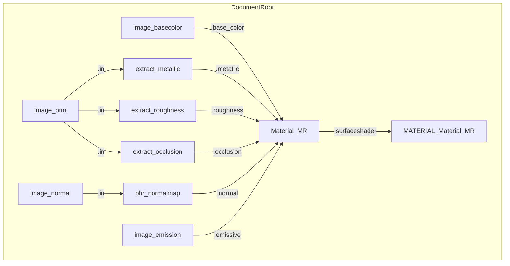

```mermaid
graph TD;
  subgraph DocumentRoot; 
    Material_MR --.surfaceshader--> MATERIAL_Material_MR
    image_basecolor --.base_color--> Material_MR
    extract_metallic --.metallic--> Material_MR
    image_orm --.in--> extract_metallic
    extract_roughness --.roughness--> Material_MR
    image_orm --.in--> extract_roughness
    pbr_normalmap --.normal--> Material_MR
    image_normal --.in--> pbr_normalmap
    extract_occlusion --.occlusion--> Material_MR
    image_orm --.in--> extract_occlusion
    image_emission --.emissive--> Material_MR
  end
```
